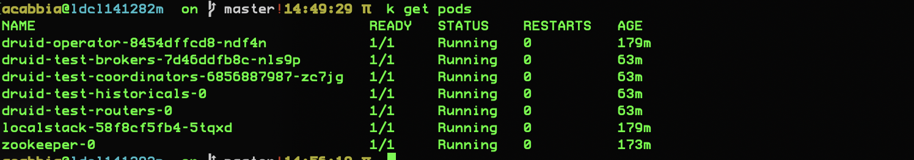
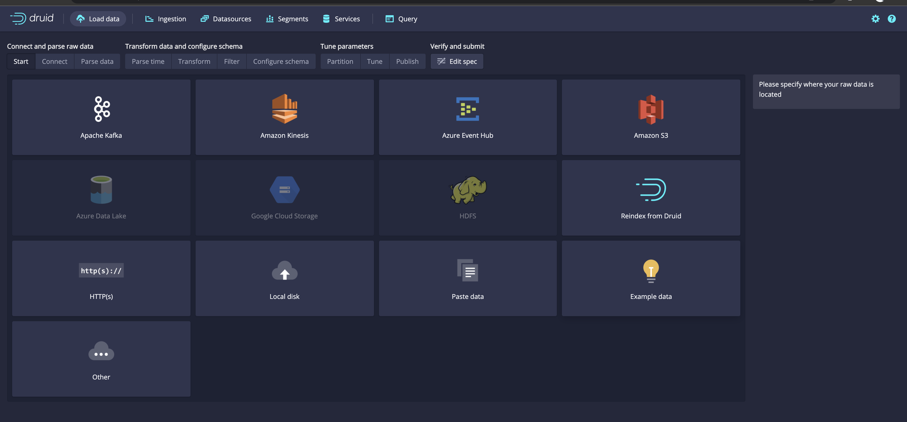

# Setup

Install helm chart repos

```
cd custom
make helm
```

Run skaffold to bring up the dependencies

```
skaffold run --profile=druid-operator
skaffold run --profile=localstack
skaffold run --profile=zookeeper
```


## Create buckets

Port forward the localstack service with: 

```
kubectl port-forward svc/localstack 14566:4566
```

and in a new shell run

```
AWS_SECRET_ACCESS_KEY=0 AWS_ACCESS_KEY_ID=0 AWS_REGION=eu-west-1 aws s3 mb --endpoint-url http://localhost:14566 s3://druid 
AWS_SECRET_ACCESS_KEY=0 AWS_ACCESS_KEY_ID=0 AWS_REGION=eu-west-1 aws s3 mb --endpoint-url http://localhost:14566 s3://archive
```

to create the `deepstorage` and (optional) `archive` buckets


# Druid

Run skaffold 

```
skaffold run
```

you should see something similar to the following once all is up (times will be smaller)



at which point we can port-forward the routers pod and see the UI

```
kubectl port-forward svc/druid-test-routers 18088:8088
```

and access it at `http://localhost:18088` via browser
try to ingest the Example Data from the `Load Data` tab 



## S3 Ingest via localstack

To get real data you might want to pipe some of them from your prod/test environment and then load them into localstack

For this you will need to port forward the localstack service with: 

```
kubectl port-forward svc/localstack 14566:4566
```

and then in a new shell run

```
# import from real s3
AWS_PROFILE=<profile> aws s3 sync s3://<bucket>/<prefix...> data/   

# create a new s3 bucket
AWS_SECRET_ACCESS_KEY=0 AWS_ACCESS_KEY_ID=0 AWS_REGION=eu-west-1 aws s3 mb --endpoint-url http://localhost:14566 s3://data

# load into localstack
AWS_SECRET_ACCESS_KEY=0 AWS_ACCESS_KEY_ID=0 AWS_REGION=eu-west-1 aws s3 sync --endpoint-url http://localhost:14566 data/<prefix>  s3://data/<prefix>
```

After this is done go again to the `Load Data` tab and click on the Amazon S3 (if a different page appears, click on `Start a new spec`)


and from there fill the `S3 prefixes` with the name of the bucket, in this case `s3://data`, set key and secret to default and the value to 0 (file [druid.yaml](custom/druid.yaml#L100) is taking care of default secrets, *this is a dev-only setup*) and keep going until you create a job spec to import all the data


# Backend query via API


For this you will need to port forward the druid brokers service with: 

```
kubectl port-forward svc/druid-test-brokers 18088:8088
```

and then simply hit it with a query

```
http POST :18088/druid/v2/sql pretty==true query='SELECT SUM("count") as "count", device FROM "data" GROUP BY "device" HAVING "count" > 10000 ORDER BY "count" DESC'
```
